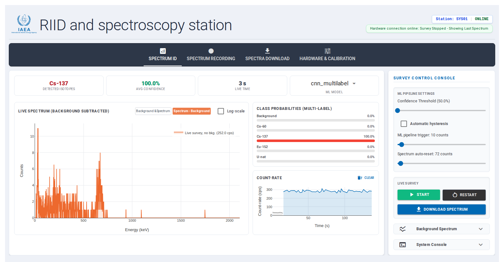
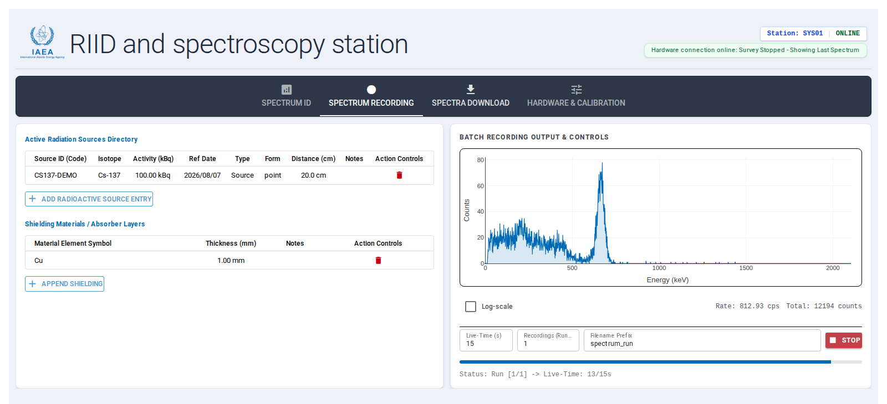
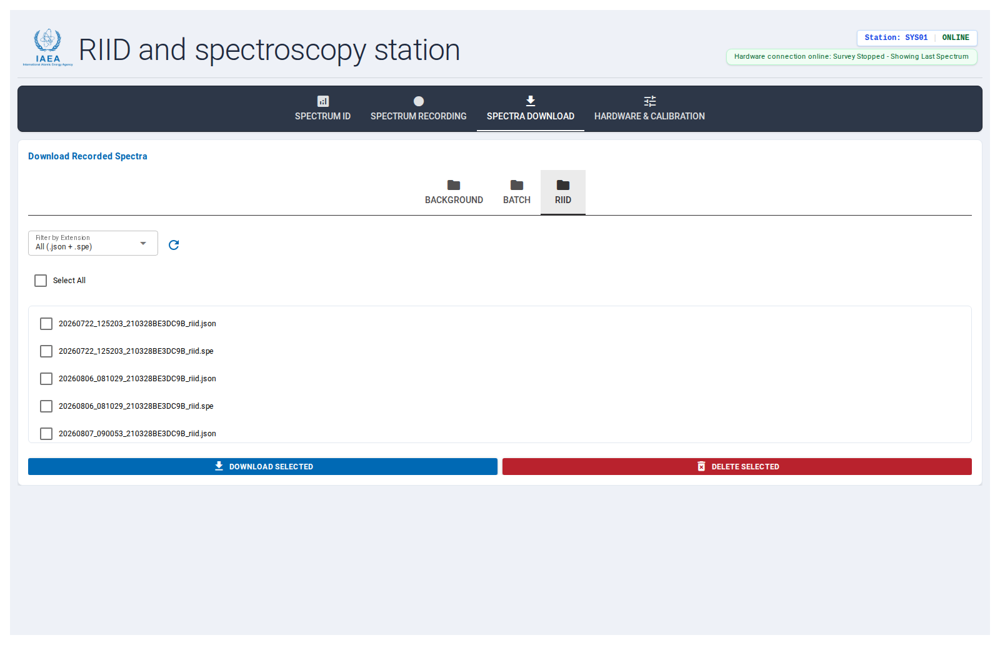
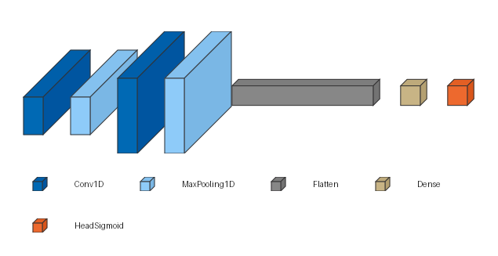
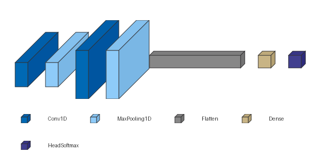

# RIID-gui

A web-based graphical user interface for radioisotope identification (RIID) built around the [NSIL-MCA-DPP4SiPM DAQ system](https://github.com/imoralesgt/NSIL-MCA-DPP4SiPM/). Developed by the Nuclear Science and Instrumentation Laboratory (NSIL) at the International Atomic Energy Agency (IAEA).  The GUI queries live spectrum acquisition from the gamma detector, background subtraction, on-device ML-based isotope classification, batch spectrum recording with source/shielding metadata, spectra download, and hardware/energy calibration — all from the web browser.

Source-level documentation (module/class/function reference, generated from docstrings) lives in [`gui/README.md`](gui/README.md) and `gui/docs/reference/`, kept in sync with `main` automatically — see [Generating the docs](#generating-the-docs) below to regenerate it locally.

For provisioning (setting up) a new Arduino UNO Q from scratch (OS prerequisites, `uv`, cloning, flashing the MCU sketch, the WiFi mode daemon), see [`docs/provisioning.md`](docs/provisioning.md).

## Repository layout

- `gui/` — the NiceGUI web application (this is what you run).
- `daq-core/NSIL-MCA-DPP4SiPM/` — git submodule containing the DAQ board firmware/hardware sources and its `python-api` communications package, which the GUI depends on to talk to the board.
- `mcu/` — Arduino UNO Q sketch driving the RIID system's onboard RGB LED and LED matrix as a physical status display, remote-controlled by the GUI over RPC. See [`mcu/README.md`](mcu/README.md).
- `wifi/` — standalone daemon that switches the system's WiFi between Access Point and Station mode, controlled from the GUI's Network Setup card (or, as an advanced/manual fallback, a jumper cable), independent of `gui/`. See [`wifi/README.md`](wifi/README.md). **Every system boots into Access Point mode by default — join SSID `IAEA_RIID_SYSXX` (passphrase `RIID_IAEA`) and browse to `http://10.42.0.1`** (port 80 for a Dockerized deployment, `:8080` for bare-metal — see [Switching between AP and Station mode](#switching-between-ap-and-station-mode) below).
- `docker/` — builds and runs `gui/` as an offline Docker container that starts on boot, the primary way to deploy a provisioned field system. See [`docker/README.md`](docker/README.md).
- `deprecated-ml-core/` — **DEPRECATED**, not a `uv` workspace member. Historical record of the RIID model R&D: preprocessing/inference prototypes, the Keras→TFLite conversion notebook, an early Arduino Uno Q deployment target, and real-hardware validation spectra. See [Machine learning model (RIID)](#machine-learning-model-riid) below.
- `utils/spectrum_recorder/` — standalone spectrum recording utility/library.

## Cloning the repository

The DAQ communications API lives in a git submodule, so clone with `--recursive` to pull it in automatically:

```bash
git clone --recursive git@github.com:imoralesgt/RIID-gui.git
cd RIID-gui
```

If you already cloned without `--recursive`, fetch the submodule separately:

```bash
git submodule update --init --recursive
```

## Running the GUI

**The Docker container is the recommended way to deploy the GUI** — an
offline container that starts on boot, isolated from whatever else is
installed on the host. Building and installing are separate steps on separate
machines: boards load and run a pre-built image, published to the
repository's [Releases](https://github.com/imoralesgt/RIID-gui/releases) as
`riid-gui.tar` - they don't build it. See
[`docker/README.md`](docker/README.md) for the exact steps.

For provisioning a fresh board, `sudo ./install.sh` from the repository root
downloads and installs the Docker service above together with the WiFi mode
daemon ([`wifi/README.md`](wifi/README.md)) in one pass - see
[`docs/provisioning.md`](docs/provisioning.md) for the full walkthrough. It
doesn't flash the MCU sketch - that's a separate, optional step run from a
development computer (see
[Physical status display](#physical-status-display-arduino-uno-q) below and
[`docs/provisioning.md`](docs/provisioning.md) step 5), needed for the
LED/matrix status display and the manual jumper AP/STA toggle, not for the
GUI or WiFi daemon themselves.

### Advanced: running directly with `uv`

Skips the Docker image - runs the GUI straight from source with
[uv](https://docs.astral.sh/uv/) managing the Python workspace (`gui`,
`utils/spectrum_recorder`, and the DAQ `python-api` submodule are workspace
members sharing one lockfile; `deprecated-ml-core/` is standalone and not
part of it). `mcu/` is standalone too, keeping an Arduino sketch with an
`arduino-cli`-based build/upload flow, unrelated to this `uv` workspace (see
[`mcu/README.md`](mcu/README.md)). Requires Python 3.12+.

Use this mode when iterating on the code: changes take effect on the
next `uv run main.py` immediately, with no Docker image rebuild in the loop.
It's not the recommended way to deploy/operate a field system - see
[`docker/README.md`](docker/README.md) for that instead.

Install dependencies from the repository root:

```bash
uv sync
```

Launch the GUI:

```bash
cd gui
uv run main.py
```

The server starts on **http://localhost:8080**. Open that URL in a browser to access the RIID system's interface. On startup, the backend automatically probes for a connected DAQ board over USB/serial; the GUI remains usable (with a clear "hardware disconnected" banner) even if no board is attached.

The RIID system's onboard computer is an Arduino UNO Q board: its Linux domain (MPU) is where `gui/` and the WiFi mode daemon run, and the microcontroller domain (MCU) drives a physical RGB LED + LED matrix status display over an internal RPC bridge — see [Physical status display](#physical-status-display-arduino-uno-q) below. The MCU side needs its own one-time sketch flash (see [`mcu/README.md`](mcu/README.md)), not something `uv sync`/`uv run` sets up; if that sketch hasn't been flashed yet (e.g. during development on a different machine, before first provisioning), the GUI detects the RPC bridge is unreachable and skips those updates rather than failing.

## GUI features

The interface is organized into four tabs. Only one acquisition-related tab is active at a time — tabs whose actions would conflict with an in-progress survey, background capture, or batch run are automatically disabled to prevent corrupting the hardware or the running measurement.

### Spectrum ID

The primary live survey workspace:

- **Live spectrum plot** — real-time counts-vs-energy chart with two visualization modes: overlaid live-survey + background spectra, or a single background-subtracted spectrum. Toggle between linear and logarithmic count scales.
- **Count-rate plot** — instantaneous counts-per-second over time, tracking whichever activity (survey or background capture) is currently running, independently clearable.
- **RIID classification** — runs a selectable on-device ML model (`cnn_multilabel` or `cnn_deep`) against the live spectrum, showing detected isotopes, average confidence, live time, and a per-class probability breakdown. **ML Pipeline Settings**, all adjustable live:
  - **Confidence Threshold** (50%-99.9%) — the per-class probability a detection must exceed to count as "detected" (colored red in the probability bars). Classification always runs regardless of this value; it only affects what's reported as detected.
  - **Automatic hysteresis** — switches the next two settings between auto-adaptive (default) and manual.
  - **ML pipeline trigger** — the peak-channel count (after background subtraction) needed before a classification is attempted; below it, the UI reports "Not enough counts for RIID". Auto: lower for a faint source, so a first result doesn't take minutes; unchanged for a source that already reaches the target quickly. Manual: a fixed value, 1-200 counts.
  - **Spectrum auto-reset** — the peak-channel count at which the accumulated spectrum is automatically cleared and re-accumulation restarts (the count-rate plot's history is kept, not reset). Needed to keep re-evaluating which isotopes are present as the surroundings change during a survey - e.g. carrying the system in a backpack or as a handheld instrument in the field - instead of blending past and present readings into one spectrum. Auto: tracks the current count rate, targeting a reset roughly every 25s. Manual: a fixed value, 1-2,000 counts.
- **Background spectrum workflow** — record a fresh background, load a previously saved one, or save the currently recorded background to disk (JSON and/or SPE format). **Important:** A background must exist before a survey can be started.
- **Survey controls** — start/stop a continuous survey, restart (clear the accumulated survey without touching the background), and download the current survey + background bundle as a `.zip` (JSON and SPE).


The "Spectrum - Background" visualization mode shows the same survey with the background subtracted out — this is the view that reflects what the ML pipeline actually computes over (its limit-of-detection gate and inference both run against the background-subtracted spectrum, not the raw overlay):



### Spectrum Recording

Batch/multi-run spectrum acquisition with experiment metadata:

- **Radiation sources directory** — register/select radioactive sources (isotope, activity, reference date, type, form, distance, notes) from a persisted database, or append ad-hoc entries for the current run only.
- **Shielding / absorber layers** — attach shielding material entries (element, thickness, notes) to the run; session-only, not persisted to a database.
- **Batch recording** — configure live-time per run, number of runs, and a filename prefix, then start/stop an automated multi-run acquisition sequence. Live plot (with an independent log-scale toggle), count-rate, and total-counts readouts update as each run completes.



### Spectra Download

Bulk file management for everything the RIID system has written to disk, organized into three categories — Background, Batch, and RIID — each with select-all, multi-file download, and permanent delete (with confirmation).



### Hardware & Calibration

- **Instrument identity** — system ID, analyzer model name, detector type/geometry/size/serial number.
- **Energy calibration** — quadratic calibration coefficients (`a0`, `a1`, `a2`) mapping ADC channel to energy (keV).
- **Advanced MCA/DPP settings** — VGA gain, channel smoothing, shaper peaking/flat-top times, detector rise/decay time constants, baseline restorer threshold gain, and pulse polarity inversion.
- **Commit Detector/MCA Settings** — persists the profile (keyed by the board's serial number) and pushes the DPP parameters down to the physical board.
- **Network Setup** — switches the system's WiFi between Access Point and Station mode. Station mode manages a list of known networks (scan for nearby ones, or add an SSID/passphrase by hand) and which one to connect to; Access Point mode sets this system's broadcast name and passphrase. Applying a change shows a warning, then a confirmation of the new settings, before taking effect.


### Physical status display (Arduino UNO Q)

Alongside the browser UI, the RIID system's Arduino UNO Q drives two onboard RGB LEDs and a 12x8 LED matrix as a physical status display, visible without a screen nearby. Both indicators are driven from the Linux side (where `gui/` and the WiFi daemon run) over an internal RPC bridge to a sketch on the microcontroller (MCU) side, which needs a one-time flash (see [`mcu/README.md`](mcu/README.md) for the firmware and full RPC protocol). If that sketch isn't flashed yet or the bridge is otherwise unreachable, the relevant software skips these updates rather than failing — useful during development, but not the expected state of a provisioned system.

#### LED4 — RIID operating status

Driven by the GUI (`gui/mcu_interface.py`) over `RIIDCoreService.set_state()`, colored by the system's current acquisition state:

| State | Color |
|---|---|
| Idle | Blue |
| Recording background | Red |
| RIID survey in progress | Green |
| Batch recording | Purple (red + blue) |

#### LED3 — WiFi mode

Driven independently by the standalone WiFi daemon (see [`wifi/README.md`](wifi/README.md) — this is unrelated to the GUI and keeps working even if the GUI isn't running):

| Mode | Color |
|---|---|
| Station (connected to a known network) | White |
| Access Point (broadcasting this system's configured SSID) | Red |

#### LED matrix

A single scrolling text display shared by both subsystems above:

- **RIID status** (from the GUI): scrolls the current state name, and during an active survey, the live detected isotope(s) (or "Background") instead.
- **WiFi mode** (from the WiFi daemon): shows for a brief moment a message on every mode change — `AP MODE`, `STA MODE: <ssid>` (the connected network's name), or `STA FAILED -> AP MODE` if a Station connection couldn't be established — then automatically reverts to whatever the GUI last set, without either subsystem needing to know about the other.

#### Switching between AP and Station mode

The **Network Setup** card (Hardware & Calibration tab) is the primary way to
switch WiFi mode: pick Access Point or Station, manage known Station
networks (scan for nearby ones, or enter an SSID/passphrase by hand), and set
the Access Point's own SSID/passphrase. Applying a change requires
confirming a warning that the system's network connection - and likely the
browser session itself, if it's reached over WiFi - is about to change.

> **Connecting to the system in Access Point mode:** join the system's
> broadcast SSID from another device, then browse to **`http://10.42.0.1`**
> — the fixed address the system always assigns itself in AP mode (port 80
> for a Dockerized deployment — see [`docker/README.md`](docker/README.md) —
> or `:8080` for a bare-metal `uv run main.py` one). In this mode the system
> isn't on any external network, so there's no hostname/Tailscale address to
> use instead. Until changed via the Network Setup card, the default SSID is
> **`IAEA_RIID_SYSXX`** (`SYSXX` = this system's own `SYS-ID`) with
> passphrase **`RIID_IAEA`**. See
> [`wifi/README.md`](wifi/README.md#software-architecture) for details.

As an advanced/manual fallback, a jumper cable wired between pin `D13` and
`GND` on the JDIGITAL header (see [`wifi/README.md`](wifi/README.md#hardware-wiring-the-jumper)
for wiring details) also toggles the WiFi mode: **holding it closed for 5+
seconds** switches between Station and Access Point. Every system boots into
Access Point mode by default; if a Station connection repeatedly fails, it
automatically falls back to Access Point mode instead (visibly, via the "STA
FAILED" matrix message above). This whole feature — GUI card, jumper, LED3,
and the AP/Station switch — is handled by a standalone daemon that the
GUI talks to over a local socket, independent of `gui/`'s process (see
[`wifi/README.md`](wifi/README.md)).

## Machine learning model (RIID)

Isotope classification runs fully on-device via [LiteRT](https://ai.google.dev/edge/litert) (TFLite), with no network calls. Compiled models live in `gui/ml_models/` and are loaded by `gui/ml_inference.py` — these are the models actually served by the GUI at runtime, independent from the deprecated R&D assets in `deprecated-ml-core/` (more on that [below](#model-rd-history-deprecated-ml-core)).

### Production models

Two selectable models (switchable from the Spectrum ID tab, only while idle), both 1-D CNNs that take the same 250-value preprocessed feature vector (see [Feature pipeline](#feature-pipeline) below) — verified directly from the shipped `.tflite` files' input/output tensors:

| Model | Input shape | Output shape | Classes |
|---|---|---|---|
| `cnn_multilabel` (default) | `(1, 250, 1)` float32 | `(1, 5)` float32 | Background, Co-60, Cs-137, Eu-152, U-nat |
| `cnn_deep` | `(1, 250, 1)` float32 | `(1, 9)` float32 | Background, Co-60, Cs-137, Eu-152, U-nat, and the mixture classes Co-60+Eu-152, Cs-137+Co-60, Cs-137+Co-60+Eu-152, Cs-137+Eu-152 |

The two models differ in what their output layer actually represents, not just class count:

- **`cnn_multilabel`** treats each isotope as an independent binary detector — its 5 outputs don't need to sum to 1, and any subset can cross the detection threshold simultaneously (e.g. Cs-137 *and* Co-60 both "on" at once for a genuine mixture the model was never explicitly trained on as a combined class).
- **`cnn_deep`** treats the 9 outputs as mutually-exclusive classes, including four pre-defined *mixture* classes trained as their own distinct targets (e.g. "Cs-137_Co-60" is one single class, not the OR of "Cs-137" and "Co-60"). It only recognizes the specific combinations it was trained on, not arbitrary isotope pairs.

Each model has its own class list and label ordering, both read from `MlInference.MODEL_LABELS` and rendered as the probability bars in the Spectrum ID tab's "Class Probabilities" panel.

Both are 1-D CNNs with an identical trunk — two `[Conv1D → MaxPooling1D]` blocks (16 then 32 filters) feeding a `Flatten → Dense(32, ReLU)` layer — that only diverges at the very last layer. The CNN heads are distributed as follows: `cnn_multilabel` ends in a `LOGISTIC` (sigmoid) op, whereas `cnn_deep` in a `SOFTMAX` op — the independent-vs-mutually-exclusive distinction described above, made visible:

<table>
<tr>
<th><code>cnn_multilabel</code> — 5-way independent sigmoid head</th>
<th><code>cnn_deep</code> — 9-way mutually-exclusive softmax head</th>
</tr>
<tr>
<td></td>
<td></td>
</tr>
</table>

Both diagrams were rendered with [`visualkeras`](https://github.com/paulgavrikov/visualkeras) from the layer shapes. To regenerate them after a model change:

```bash
cd gui
uv sync --group viz
uv run --group viz python docs/scripts/render_architecture_diagrams.py
```

This overwrites `docs/res/cnn_multilabel_architecture.png` and `docs/res/cnn_deep_architecture.png` in place. The `viz` group (`tensorflow`, `tf-keras`, `visualkeras`) is only pulled in when explicitly requested — it's not part of the default `uv sync`.

### Feature pipeline

Inference (`ml_inference.py::inference_pipeline`, preprocessing in `ml_preprocessing.py`) runs against the live spectrum on every tick:

1. **Background subtraction** (`MLPreprocessing.subtract_background`) — the background is normalized to the survey's live time and subtracted from the live spectrum; negative results are clipped to zero.
2. **Limit-of-detection gate** — if the tallest channel of the background-subtracted spectrum doesn't exceed the "ML pipeline trigger" (default 10 counts, see [ML Pipeline Settings](#spectrum-id) above), inference is skipped and the UI reports "Not enough counts for RIID" rather than a low-confidence guess.
3. **Feature preprocessing** (`MLPreprocessing.preprocess_log10`) — crops the first 50 low-energy channels (LLD region), applies `log10(counts + 1)` scaling, smooth with a Savitzky-Golay filter (window length 11, polynomial order 3), decimates by a factor of 8 (every 8th sample), then normalizes to unit area (values sum to 1).
4. **TFLite inference** — the preprocessed vector is fed to the ML inference model, returning a probability (0.0-1.0) per class.

The DPP4SiPM hardware outputs a 2048-channel spectra. Steps 1 and 3 are shape-preserving except for the crop and decimation, so: `(2048 - 50) / 8 = 250` — the `(1, 250, 1)` input both models expect. The 2048-channel raw spectrum, the 50-bin crop, and the decimate-by-8 factor all have to agree for the vector the model receives live to match what it saw during training, which is why `MLPreprocessing`'s defaults (`crop_bins_lld=50`, `decimation=8`, `sg_window_length=11`, `sg_polyorder=3`) shouldn't be changed independently of a corresponding model retrain.

A class only counts as "detected" (surfaced in the Detected Isotopes metric card, and colored red in its probability bar) once its probability exceeds the user-adjustable *Confidence Threshold* (default 50%, range 50%-99.9%), which can be changed live even mid-survey — the underlying inference always returns the full, unfiltered per-class breakdown regardless of this threshold.

### Model R&D history (`deprecated-ml-core/`)

`deprecated-ml-core/` is a standalone (non-workspace) project retaining artifacts from the models' development:

- **`keras-to-tflite.ipynb`** — converts a trained Keras model to TFLite (`TFLiteConverter` with default optimizations). Its retained output shows `cnn_deep`'s architecture as a 1-D CNN: three `[Conv1D → MaxPool1D → Dropout]` blocks (16 filters each) feeding a `Flatten → Dense(32) → Dropout → Dense(N classes)` head. That captured run is from an earlier 6-class snapshot (`bkg`/`co`/`coeu`/`cs`/`csco`/`eu`, 18,310 params, 28.6KB `.tflite`) — the final 9-class models actually shipped in `gui/ml_models/` are larger (~74KB each) and weren't re-exported through this notebook, so treat it as documenting the architecture *family*, not the exact final layer sizes.
- **`preprocessing.py`** — the same feature-pipeline logic now in `gui/ml_preprocessing.py`, plus three exploratory variants not used in production: `preprocess_no_log` (no log scaling), `preprocess_baseline` (fixed-length raw normalization), and `preprocess_roi` (statistical features - max/sum/argmax/std/percentiles - extracted from predefined energy windows around each isotope's known photopeaks). `models/tflite/` correspondingly retains `roi.tflite`, `mlp_log.tflite`, `mlp_no_log.tflite`, `mlp_raw.tflite`, and `cnn_log.tflite` — alternative architectures/feature sets evaluated during model selection before settling on the CNN + log10-preprocessing combination that became `cnn_deep`/`cnn_multilabel`. Note its default crop is 20 bins, vs. 50 in the deployed `gui/ml_preprocessing.py` - a parameter that shifted between this R&D snapshot and the final production pipeline.
- **`io_utils.py`** — spectrum file I/O for both `.spe` and `.json`, plus `resample_to_energy_grid`: since training spectra were collected across multiple detector units with different energy calibrations, it linearly interpolates every spectrum onto a shared 0-2047 keV, 1 keV/bin grid (area-conserving) before use, so the model sees a consistent energy axis regardless of which physical detector or calibration produced the data.
- **`data/NML/`** — real single-isotope and mixture spectra recorded from DPP4SiPM hardware (Cs-137, Co-60, Ba-133, and combinations like Co-60+Cs-137 and Ba-133+Cs-137, at 5s and 30s live times) — used to validate the trained models against genuine detector output rather than only simulated/held-out training data.
- **`inference.py` / `mcu.cpp` / README** — an early standalone deployment target (an Arduino Uno Q board over serial) for running inference outside the GUI entirely; superseded by the GUI's `ml_inference.py` pipeline, kept here for reference.

## Generating the docs

The GUI's source-level reference documentation ([`gui/README.md`](gui/README.md) + `gui/docs/reference/*.md`) is generated from the docstrings in `gui/*.py` via [lazydocs](https://github.com/ml-tooling/lazydocs) — the same tool already used for the `daq-core/NSIL-MCA-DPP4SiPM` submodule's `python-api` reference. It's automatically regenerated and committed back to `main` on every push that touches `gui/**` (see `.github/workflows/gui-docs.yml`).

To regenerate it locally:

```bash
cd gui
uv sync --group docs
PYTHONPATH=. uv run --group docs lazydocs \
  --output-path docs/reference \
  --src-base-url "https://github.com/imoralesgt/RIID-gui/blob/main/" \
  config main riid_service state_engine ml_inference ml_preprocessing mcu_interface \
  view_spectrum_id view_recording view_download view_calibration
```

## License

[BSD 2-Clause](LICENSE).
