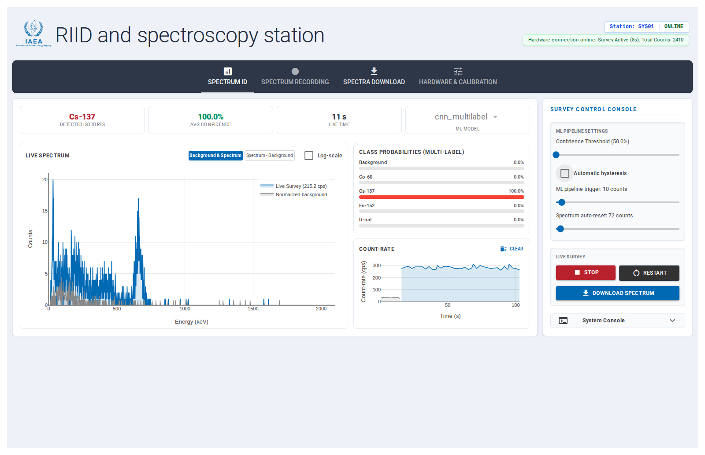
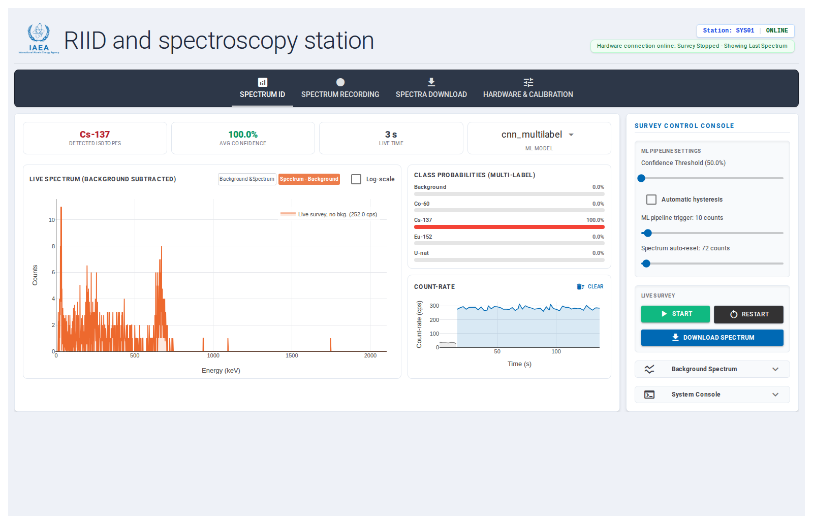
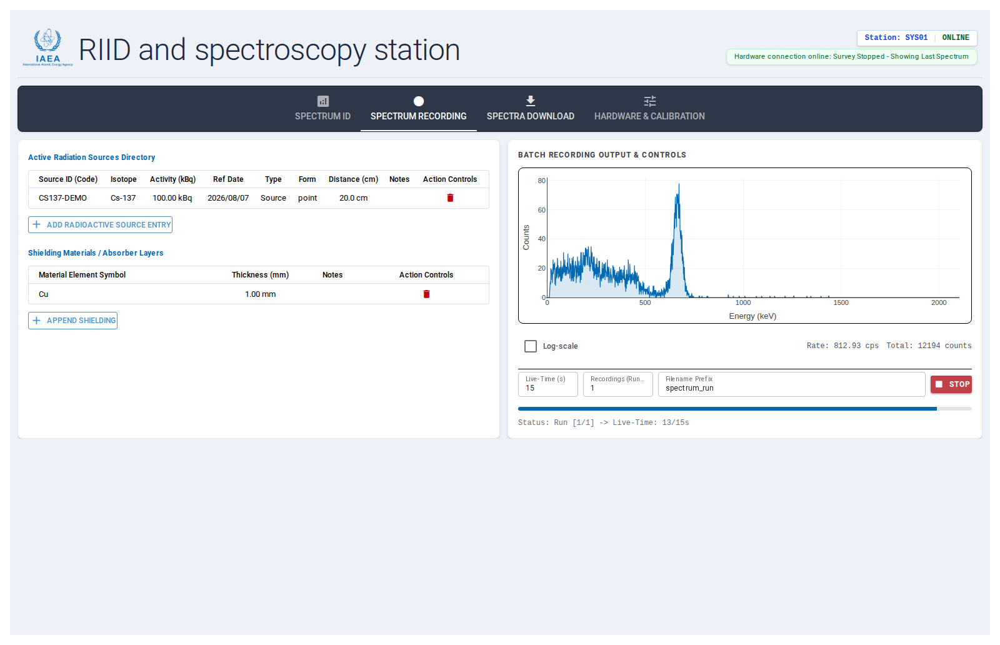
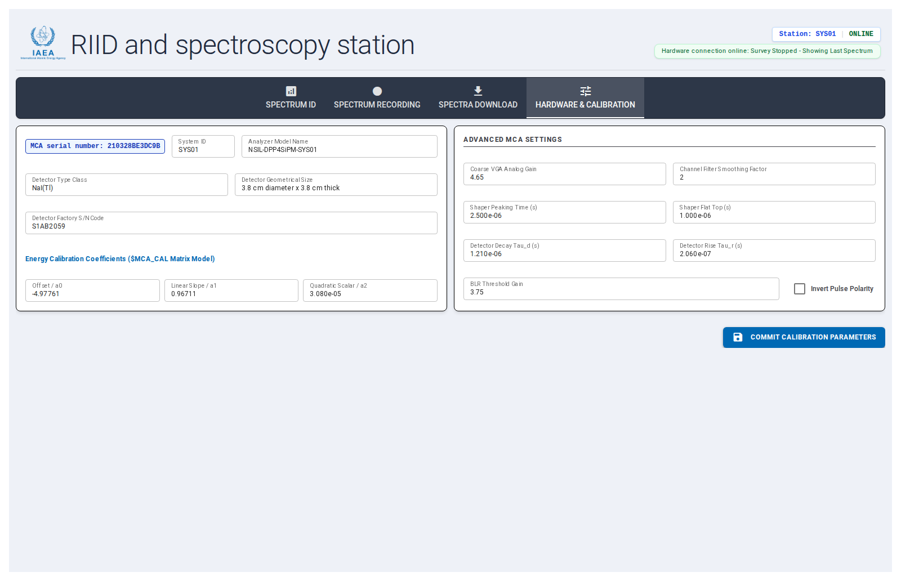

# RIID-gui

A web-based graphical user interface for radioisotope identification (RIID) built around the NSIL-MCA-DPP4SiPM DAQ system. Developed by the Nuclear Science and Instrumentation Laboratory (NSIL) at the International Atomic Energy Agency (IAEA).  The GUI queries live spectrum acquisition from the gamma detector, background subtraction, on-device ML-based isotope classification, batch spectrum recording with source/shielding metadata, spectra download, and hardware/energy calibration — all from the web browser.

Source-level documentation (module/class/function reference, generated with Sphinx) is published from `gui/docs/` at every merge to `main` — see [Generating the docs](#generating-the-docs) below to build it locally.

## Repository layout

- `gui/` — the NiceGUI web application (this is what you run).
- `daq-core/NSIL-MCA-DPP4SiPM/` — git submodule containing the DAQ board firmware/hardware sources and its `python-api` communications package, which the GUI depends on to talk to the board.
- `ml-core/` — **DEPRECATED** ML model training/inference assets (TFLite models, preprocessing) used by the GUI's RIID pipeline.
- `utils/spectrum_recorder/` — standalone spectrum recording utility/library.

## Cloning the repository

The DAQ communications API lives in a git submodule, so clone with `--recursive` to pull it in automatically:

```bash
git clone --recursive git@github.com:imoralesgt/RIID-gui.git
cd RIID-gui
```

If you already cloned without `--recursive`, fetch the submodule separately:

```bash
git submodule update --init --recursive
```

## Running the GUI

This project uses [uv](https://docs.astral.sh/uv/) to manage the Python workspace (`gui`, `ml-core`, `utils/spectrum_recorder`, and the DAQ `python-api` submodule are all workspace members sharing one lockfile). Requires Python 3.12+.

Install dependencies from the repository root:

```bash
uv sync
```

Launch the GUI:

```bash
cd gui
uv run main.py
```

The server starts on **http://localhost:8080**. Open that URL in a browser to access the station interface. On startup, the backend automatically probes for a connected DAQ board over USB/serial; the GUI remains usable (with a clear "hardware disconnected" banner) even if no board is attached.

## GUI features

The interface is organized into four tabs. Only one acquisition-related tab is active at a time — tabs whose actions would conflict with an in-progress survey, background capture, or batch run are automatically disabled to prevent corrupting the hardware or the running measurement.

### Spectrum ID

The primary live-survey workspace:

- **Live spectrum plot** — real-time counts-vs-energy chart with two visualization modes: overlaid live-survey + background spectra, or a single background-subtracted spectrum. Toggle between linear and logarithmic count scales.
- **Count-rate plot** — instantaneous counts-per-second over time, tracking whichever activity (survey or background capture) is currently running, independently clearable.
- **RIID classification** — runs a selectable on-device ML model (`cnn_multilabel` or `cnn_deep`) against the live spectrum, showing detected isotopes, average confidence, live time, and a per-class probability breakdown. Detection confidence threshold and the minimum-counts trigger for attempting classification are both adjustable live.
- **Background spectrum workflow** — record a fresh background, load a previously saved one, or save the currently recorded background to disk (JSON and/or SPE format). A background must exist before a survey can be started.
- **Survey controls** — start/stop a continuous survey, restart (clear the accumulated survey without touching the background), and download the current survey + background bundle as a `.zip` (JSON and SPE).



The "Spectrum - Background" visualization mode shows the same survey with the background subtracted out — this is the view that reflects what the ML pipeline itself actually reasons over (its limit-of-detection gate and inference both run against the background-subtracted spectrum, not the raw overlay):



### Spectrum Recording

Batch/multi-run spectrum acquisition with experiment metadata:

- **Radiation sources directory** — register/select radioactive sources (isotope, activity, reference date, type, form, distance, notes) from a persisted database, or append ad-hoc entries for the current run only.
- **Shielding / absorber layers** — attach shielding material entries (element, thickness, notes) to the run; session-only, not persisted to a database.
- **Batch recording** — configure live-time per run, number of runs, and a filename prefix, then start/stop an automated multi-run acquisition sequence. Live plot (with its own independent log-scale toggle), count-rate, and total-counts readouts update as each run completes.



### Spectra Download

Bulk file management for everything the station has written to disk, organized into three categories — Background, Batch, and RIID — each with select-all, multi-file download, and permanent delete (with confirmation).


### Hardware & Calibration

- **Instrument identity** — system ID, analyzer model name, detector type/geometry/size/serial number.
- **Energy calibration** — quadratic calibration coefficients (`a0`, `a1`, `a2`) mapping ADC channel to energy (keV).
- **Advanced MCA/DPP settings** — VGA gain, channel smoothing, shaper peaking/flat-top times, detector rise/decay time constants, baseline restorer threshold gain, and pulse polarity inversion.
- **Commit** — persists the profile (keyed by the board's serial number) and pushes the DPP parameters down to the physical board.



## Machine learning model (RIID)

Isotope classification runs fully on-device via [LiteRT](https://ai.google.dev/edge/litert) (TFLite), with no network calls. Compiled models live in `gui/ml_models/` and are loaded by `gui/ml_inference.py` — these are the models actually served by the GUI at runtime, independent from `ml-core/`, which is deprecated.

Two selectable models (switchable from the Spectrum ID tab, only while idle):

| Model | Classes | Notes |
|---|---|---|
| `cnn_multilabel` (default) | Background, Co-60, Cs-137, Eu-152, U-nat | Per-class probabilities are independent (multi-label) — multiple isotopes can be flagged simultaneously. |
| `cnn_deep` | Background, Co-60, Cs-137, Eu-152, U-nat, and the mixture classes Co-60+Eu-152, Cs-137+Co-60, Cs-137+Co-60+Eu-152, Cs-137+Eu-152 | Trained over specific isotope-mixture combinations rather than independent per-isotope probabilities. |

Each model has its own class list, rendered as the probability bars in the Spectrum ID tab's "Class Probabilities" panel.

Inference pipeline (`ml_inference.py::inference_pipeline`, preprocessing in `ml_preprocessing.py`), run against the live spectrum on every tick:

1. **Background subtraction** — the background is normalized to the survey's live time and subtracted from the live spectrum; negative results are clipped to zero.
2. **Limit-of-detection gate** — if the tallest channel of the background-subtracted spectrum doesn't exceed the "ML pipeline single-channel trigger" (default 20 counts, adjustable 1-200 in the Spectrum ID sidebar), inference is skipped entirely and the UI reports "Not enough counts for RIID" rather than a low-confidence guess.
3. **Feature preprocessing** — crop the first 50 low-energy channels (LLD region, not diagnostic), apply `log10(counts + 1)` scaling, smooth with a Savitzky-Golay filter (window length 11, polynomial order 3), decimate by a factor of 8, then normalize to unit area — reproducing the exact vector shape/scale the model was trained on.
4. **TFLite inference** — the preprocessed vector is fed to the interpreter, returning a probability (0.0-1.0) per class.

A class only counts as "detected" (surfaced in the Detected Isotopes metric card, and colored red in its probability bar) once its probability exceeds the operator-adjustable Confidence Threshold (default 50%, range 50%-99.9%), which can be changed live even mid-survey — the underlying inference always returns the full, unfiltered per-class breakdown regardless of this threshold.

## Generating the docs

The GUI's source-level reference documentation is built with [Sphinx](https://www.sphinx-doc.org/) from the docstrings in `gui/*.py`, and is automatically rebuilt and published to GitHub Pages on every merge to `main` (see `.github/workflows/gui-docs.yml`).

To build it locally:

```bash
cd gui
uv sync --group docs
uv run --group docs sphinx-build -b html docs docs/_build/html
```

Open `gui/docs/_build/html/index.html` in a browser to view it.
